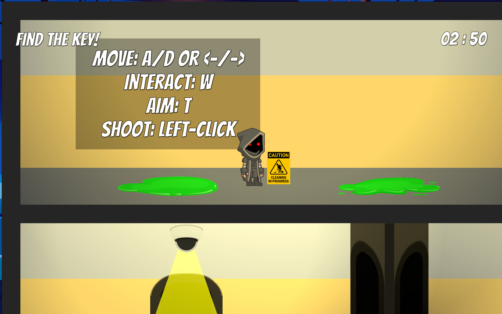

# ROBIN THE EXAM SAVIOUR

## Description

This game draws inspiration from *Bob the Robber* and follows the adventures of Robin, a determined student on a mission to steal an important exam from the professor’s desktop in order to graduate. Throughout the game, Robin faces a variety of challenges, including evading campus security, avoiding cameras, dodging lasers, and solving puzzles. One of those puzzles includes inputting the correct pattern that is displayed on a vending machine in order to unlock an item crucial to the completion of the level. Players must use stealth, strategy, and problem-solving skills to successfully navigate each obstacle and complete Robin's daring heist.

## Installation Guide

1. Go to the itch.io page for the game found in this [URL](https://blackthorn03.itch.io/robin-the-exam-saviour)
2. Download the zipped folder
3. Extract the zipped folder by right clicking the compressed folder (Right Click > Extract here)
4. Run the "Robin The Exam Savior" executable found in the main folder

## Playing Instructions

- **Movement**:
  - Press `A` to move to the left
  - Press `D` to move to the right
  - Press `Space` to jump

- **Hide behind pillar**:
  - Press `W` after placing the character in front of a pillar

- **Changing floor**
  - Press `W` after placing the character in front of a door and he will switch floors appearing on the door directly below/above the one you placed it initially

- **Interaction with Power-Up**
  - Simply collide with power-ups in order to collect and use them

- **Pick item**
  - Press `W` to collect/pick the item

- **Throw item**
  Once an item is collected/picked up:
  - 1st: Press `T`to enter the throwable mode
  - 2nd: Aim using the mouse/trackpad
  - 3rd: Click on the `LMB` (left mouse button) to throw/shoot the item

- **Power-ups**
  - **Coffee**: Once the coffee is collected (by collision) the player gets a 2x speed boost for the next 10 seconds
  - **Clock**: Once the clock is collected (by collision) the player adds 30 more seconds to the time he has available to finish the level

- **Rope interaction**
  - 1st: Press `W` once on top of the hole to enter the rope stealth mode
  - 2nd: Press `W` to climb upwards and `S` to fall faster (by pressing nothing the character falls slower)
  - 3rd: To exit the rope stealth mode simply press `W` until you go upwards back through the hole

- **Avoiding security**
  - Staying out of the security's detection area displayed (while yellow it is not safe to enter, so wait until it is green)
  - Using pillars to hide behind them

- **Avoiding robot guard**
  - Jumping over the robot's head
  - Throwing the sandwich throwable against it's head to deactivate it

- **Avoiding traps**
  - Simply avoid colliding with the character against them

- **Unlock door**
  - Throw an item into the button attached to the wall that matches the locked door's color and it shall open it

- **Vending machine puzzle**
  - Jump on the pressure plates laying in front of the vending machine following the pattern displayed on it (the progress bar will serve as an indicator of how close you are of completing the pattern)

## Group members

| Name | Email |
| :--- | :--- |
| David Amorim Corderiro| up202108820@up.pt |
| Diogo Silveira Viana | up202108803@up.pt |

## Credits

#### Resources used

- In-Game assets:
  - Majority of the assets: [KENNEY](https://www.kenney.nl)
    - https://www.kenney.nl/assets/platformer-art-deluxe
    - https://www.kenney.nl/assets/generic-items
  - Main character: [BOJEDIMA](https://bojedima.itch.io/darkassassin)
  - Security NPC: [CRAFTPIX.NET](https://craftpix.net/freebies/2d-game-police-character-free-sprite-sheets/)
  - Robot guard NPC: [Shane-Lee](https://shane-lee.itch.io/2d-robot-game-character-asset-pack-free-download)
  - Desk: [GameArtGuppy](https://www.gameartguppy.com/shop/home-objects-icons/)
  - Cell door: [FREEP!K](https://www.freepik.com/free-vector/jail-cell-prison-dining-visiting-room-furniture-interior-design-elements-cartoon_4393632.htm#fromView=keyword&page=1&position=27&uuid=44d1f32a-8afd-4b93-8ddf-83a70a6d9666&query=Prison+Door+Sprite)
  - Lock: [FREEP!K](https://www.freepik.com/free-vector/locker_2900480.htm#fromView=search&page=1&position=0&uuid=26d3722c-bbcc-4539-9fff-6beddcaa6db3&query=lock+2d)
  - Rope: [FREEP!K](https://www.freepik.com/free-vector/coiled-rope-vector-illustration_151612913.htm#fromView=search&page=1&position=18&uuid=1169e858-2e27-45da-b651-04dec6a9bfdd&query=2d+rope)
  - Clock: [FREEP!K](https://www.freepik.com/free-vector/modern-clock-deadline-countdown_136479336.htm#fromView=search&page=1&position=6&uuid=f19aebfd-322e-4748-af98-a467969524e4&query=clock+2d)
  - Hole: [FREEP!K](https://www.freepik.com/free-vector/broken-concrete-wall-with-hole-crack-floor-effect_370012034.htm#fromView=search&page=1&position=1&uuid=17d1a7d4-0706-4a30-ba44-853ad8d0fe6c&query=hole)
  - Sandwich: [FREEP!K](https://www.freepik.com/free-vector/sticker-design-with-sandwich-isolated_16859930.htm#fromView=search&page=1&position=2&uuid=9f8f2059-f846-4408-a99b-059c417da90e&query=sandwich+2d)
  - Background image: [FREEP!K](https://www.freepik.com/free-vector/ice-rink-night-empty-public-place-skating_6823050.htm#fromView=keyword&page=1&position=31&uuid=63903794-17e2-4945-a731-15f294aa5a12&query=2d+Game+Background+Night)
  - Vending Machine: [DALL·E 3](https://openai.com/index/dall-e-3/)
  - Cleaning sign: [FREEP!K](https://www.freepik.com/premium-vector/cleaning-progress-sign_36707754.htm)
  - Security camera: [nvere](https://www.renderhub.com/nvere)
  - Slowdown trap: [Valery Khadeiev](https://depositphotos.com/portfolio-5857850.html?content=vector)
  - Chewed gum: [Eldarya](https://www.eldarya.com/)
- UI assets:
  - Buttons: [itch.io](https://prinbles.itch.io/analogue-buttons-pack-i)
  - Input prompts: [KENNEY](https://www.kenney.nl/assets/input-prompts)
  - Menu background & Cover image: [Flux AI](https://flux-ai.io/)
- SFX:
  - Pick up: [Kronbits](https://kronbits.itch.io/)
  - Victory: [celestialghost8](https://opengameart.org/content/victory)
  - Defeat: [KLY](https://opengameart.org/content/kl-peach-game-over-iii)
- Music:
  - [Matthew Pablo](https://opengameart.org/content/evasion)
